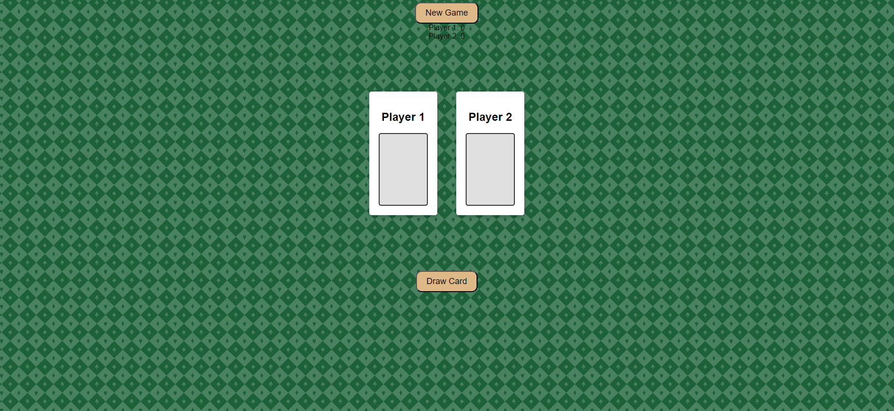

WAR GAME STARTER CODE

[PLAY THE GAME](https://thomaswarcardgame.netlify.app)

## War Card Game Description
The deck is divided evenly, with each player getting 26 cards, dealt one at a time, face down. Anyone may deal first. Each player places their stack of cards face down, in front of them. Each player turns up a card at the same time and the player with the higher card takes both cards and puts them at the bottom of their deck. If the cards are the same, it is War. Each player turns up one card face down and one card face up. The player with the higher cards takes the cards. If the cards are again the same value, each player places another card face down and turns another card face up. The player with the higher card takes all cards, and so on. The goal is to be the first player to win all 52 cards.

1. Shuffle the deck

2. Divide the deck evenly, 26 cards to each player
3. Both players reveal the top card of their decks and place them on the table
4. Compare players’ card value. The player with the higher value card takes both cards on the table and place those cards at the bottom of their deck
5. If player 1 and 2 revealed cards with same value war begins
6. When war begins, both players put next two cards from the top of their own deck on the table and reveal the second card
7. Compare the cards’ value
8. The player with the highest second revealed card takes all the cards
face them down and then put them on the bottom of his/her own deck
9. If player 1 and 2 second revealed cards still have the same value, back to No.5 and continue.
10. The player who win the “war”, takes all cards on the desk, face them down and put them to the  bottom of his/her own deck

### Requirements
Must account for war and double war conditions.

### Tech used:
-JavaScript

-CSS

-HTML

-GIT

### Attributions/Help:
https://fonts.google.com/

-FreeCodeCamp

-MDN Webdocs

-CSS Card Intro

-w3schools

### IceBox Items:
-Add function to change usernames

-add animations to shuffle cards and draw cards

-add stacking effect to show that 